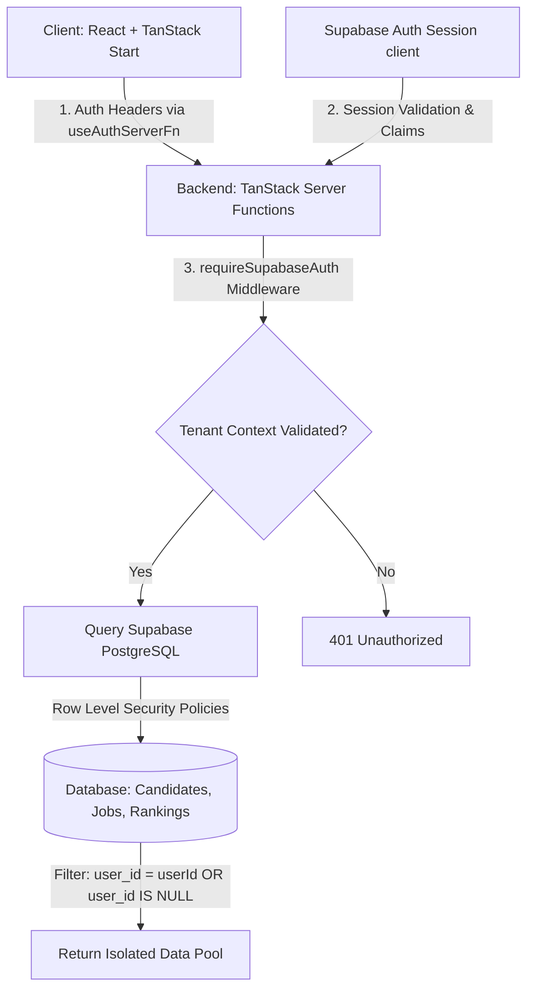

# Talent Intelligence OS (TalentOS) 🚀

Talent Intelligence OS (TalentOS) is a modern, premium AI-powered recruitment intelligence platform. It is designed to perform localized, high-precision candidate ranking and matching that goes beyond simple keyword searching. By leveraging semantic embeddings, structured skill alignment, experience weighting, and behavioral signals, it identifies the best-fit talent for any job description.

---

## 📐 System Architecture

TalentOS is built as a highly secure, multi-tenant system using a modern, split-panel client-server architecture:



---

## 🔐 The Multi-User Tenant Isolation Story

Originally, the database shared all candidate profiles, jobs, and rankings globally across all visitors. To support modern enterprise recruiting teams, we implemented **strict multi-user isolation (multi-tenancy)**:

### 1. Database Tenancy Schema
We altered the base schemas for `candidates`, `jobs`, and `rankings` to include a `user_id` column pointing directly to `auth.users(id)`. 
* **Row Level Security (RLS)** is active on these tables.
* **RLS Policies** ensure that users can only select, insert, or modify their own records.
* **Global Seed Data Preservation**: Records where `user_id IS NULL` remain globally visible to all newly registered accounts as default seed data, ensuring users do not log into a completely blank dashboard.

### 2. Transparent JWT Bearer Propagation
A custom React hook, `useAuthServerFn(...)`, wraps Vite’s TanStack Start `useServerFn`. It automatically extracts the active Supabase authentication JWT token on the client and attaches it as an `Authorization: Bearer <JWT>` header to all RPC requests.

### 3. Server-Side Middleware Scoping
Every server function is protected by the `requireSupabaseAuth` middleware. It:
1. Validates the JWT token directly against your Supabase Auth server.
2. Extracts the unique user ID (`context.userId`).
3. Enforces queries to filter by: `.or(user_id.eq.${userId},user_id.is.null)`.
4. Appends `user_id: userId` to all newly created jobs, candidates, and rankings.

---

## 📧 Supabase Auth & Custom Resend SMTP Configuration

TalentOS uses a step-by-step registration wizard that verifies email authenticity via a **6-digit OTP code** before allowing the user to configure a password:

```
[Enter Email] ──> [Send 6-Digit OTP] ──> [Verify OTP] ──> [Configure Password] ──> [Redirect to Dashboard]
```

### Bypassing SMTP Link Defaults
By default, Supabase sends a clickable magic link instead of a 6-digit code. To support direct OTP code entry inside the app:
1. **Enable Custom SMTP**: Go to your **Supabase Dashboard** -> **Authentication** -> **Emails** -> **SMTP** and configure **Resend** (which is completely free):
   * **Host**: `smtp.resend.com`
   * **Port**: `587`
   * **Username**: `resend`
   * **Password**: *Your Resend API Key (`re_...`)*
2. **Email Templates**: Update the **Confirm signup** and **Magic Link** templates in your Supabase dashboard to print the code using the **`{{ .Token }}`** variable:
   ```html
   <p>Your TalentOS verification code is: <strong>{{ .Token }}</strong></p>
   ```

> [!NOTE]
> **Resend Sandbox Limitation**: On Resend's free tier, you can only send emails to the email address you registered your Resend account with. To send OTP codes to any arbitrary email address, you must verify a custom domain (e.g. `yourdomain.com`) in your Resend Dashboard and add a corresponding **DMARC TXT DNS record** (`_dmarc.yourdomain.com` with value `v=DMARC1; p=none;`).

---

## 💎 Custom Neumorphic UX & Animation Experience

The sign-in interface is designed as an editorial, high-contrast experience:
* **Cyberpunk Product Showcase (Left)**: Dark, neon-glow gradient dashboard graphics displaying the metric highlights.
* **macOS Neumorphic Console (Right)**: A soft, tactile light-grey card (`#e0e0e0`) housing form elements built with a neumorphic shadow formula:
  * **Default state shadow**: `4px 4px 10px #bcbcbc, -4px -4px 10px #ffffff`
  * **Hover state shadow**: `inset 3px 3px 6px #bcbcbc, inset -3px -3px 6px #ffffff` (giving it a sunken, tactile appearance).
  * **Active state shadow**: `inset 5px 5px 10px #bcbcbc, inset -5px -5px 10px #ffffff` (representing a physical button press).

### Key-Lock Success Animation
When a user sets their password to complete registration, the interface transitions to a **Success Screen**:
1. A **Key icon** rotates and slides in horizontally.
2. A **Lock icon** pops into view and snaps locked.
3. An emerald radial pulse wave propagates outwards.
4. A warning notice is displayed: **"⚠️ Remember your password for further logins!"**
5. The workspace redirects automatically to the dashboard after `3.8s`.

---

## ⚡ Self-Healing Guest Sandbox
For testers and developers, the **Guest Sandbox** button offers instant access:
1. When clicked, it calls the backend server function `createConfirmedGuestUser`.
2. This function utilizes the Supabase Admin client to programmatically create the guest account (`guest@talentos.com`) with **`email_confirm: true`** pre-set.
3. The client then performs a standard password login. This bypasses the SMTP email check entirely, letting developers enter the workspace with a single click.

---

## 📐 Hybrid Scoring Formula

For each candidate $c$ and job $j$, the ranking engine computes a composite score:

$$
\begin{aligned}
\text{Final Score} = \quad & w_{\text{semantic}} \cdot \text{CosineSimilarity}(\text{Emb}_j, \text{Emb}_c) \\
+ & w_{\text{skill}} \cdot \left(0.75 \cdot \text{RequiredOverlap} + 0.25 \cdot \text{NiceToHaveOverlap}\right) \\
+ & w_{\text{experience}} \cdot e^{-\frac{(\text{Years}_c - \text{TargetYears})^2}{2\sigma^2}} \quad \left[\sigma = \max(2, \text{TargetYears} \cdot 0.5)\right] \\
+ & w_{\text{behavioral}} \cdot \text{Normalize}(\text{Logins} + \text{ResponseRate} + \text{ReplySpeed} + \text{DecayedActiveSignal})
\end{aligned}
$$

### Default Configuration Weights:
* **Semantic Weight**: `0.50` (dense vector embeddings)
* **Skill Overlap**: `0.25` (must-have and nice-to-have aligned criteria)
* **Experience Fit**: `0.10` (Target-years deviation bell curve)
* **Behavioral Score**: `0.15` (Logins activity, response rates, and reply speeds)

---

## 💻 Environment Variables (.env)

Make sure the following variables are defined in your `.env` file at the project root:

```bash
# Supabase Configuration
SUPABASE_URL="https://your-project.supabase.co"
SUPABASE_PUBLISHABLE_KEY="your-supabase-anon-key"
SUPABASE_SERVICE_ROLE_KEY="your-supabase-service-role-key"

# Gemini API Configuration
GEMINI_API_KEY="your-google-gemini-api-key"
```

---

## 🚀 Running the Project

### Installation
```bash
npm install
# Or with Bun:
bun install
```

### Development Server
```bash
npm run dev
# Or with Bun:
bun run dev
```

### Production Build & Deployment Check
```bash
npm run build
npm run start
```
